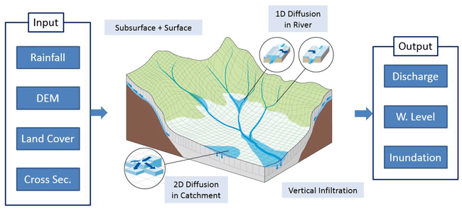

[](https://github.com/menvuthy/rri_calib/releases)
[](./LICENSE)
[](https://www.python.org)


**To support my work, please put a Star :star: on this repository! Thank you :bowing_man:** 


# Auto‑Calibration Program for Rainfall-Runoff Inundation (RRI) Model in Python

---
d
*<font color='grey'>**Developer:** Men Vuthy (MEng), Water Resources and Energy Department, Nippon Koei, 2026*</font> 

---

This repository provides a **Python‑based automatic calibration framework** for the **Rainfall–Runoff–Inundation (RRI) model** using the **SCE‑UA** global optimization algorithm implemented via **SPOTPY**.

The framework is designed to automate RRI model calibration, reduce manual trial‑and‑error, and improve reproducibility in hydrological and flood modeling studies.

---



Schematic Diagram of Rainfall-Runoff-Inundation (RRI) Model (Sayama et al., 2012)

## 📋 Table of Contents

- [Key Features](#key-features)
- [Calibration Workflow](#why-version-310)
- [Repository Structure](#features)
- [Requirements](#quick-start)
- [Installation](#configuration)
- [Input Data](#troubleshooting)
- [Running Auto‑Calibration](#development)
- [Outputs](#usage-examples)
- [Notes/Disclaimer](#contributing)
- [Acknowledgments](#testing)
- [License](#technical-details)
- [Contact](#contact)

## Key Features

- Automatic calibration of RRI model parameters
- Global optimization using the SCE‑UA algorithm
- Integration with SPOTPY optimization framework
- Support for common objective functions (RMSE, MAE, R²)
- Flexible parameter range definition
- CSV‑based logging of calibration results
- Reproducible environment using Conda (`environment.yml`)

---

## Calibration Workflow

The auto‑calibration process follows these steps:

1. Initialize the RRI calibration model
2. Read calibration settings and parameter ranges
3. Load observed discharge data
4. Execute repeated RRI simulations
5. Evaluate model performance using an objective function
6. Search for optimal parameters using SCE‑UA
7. Save calibration logs and optimal parameter sets

---

## Repository Structure

```bash
project_root/
│
├─ rri_calib/
│   ├─ init.py
│   └─ calibrator.py        # CalibrateRRI class
│
├─ notebooks/
│   └─ run_calibration.ipynb
│
├─ data/
│   ├─ obs/                 # Observed discharge (CSV)
│   └─ sim/                 # RRI simulation outputs
│
├─ environment.yml          # Conda environment (recommended)
├─ ParameterSetting.xlsx    # Calibration parameter definition
└─ README.md
```


## Requirements

This notebook requires a Conda environment with the following main dependencies:

- Python (recommended: 3.10)
- SPOTPY
- Scikit-learn
- NumPy
- Pandas
- SciPy
- Matplotlib

The environment can be created using the provided `environment.yml` file.

## Installation

### Prerequisites
- Anaconda installed on your system  
  (https://www.anaconda.com/)

---

### Step 1: Clone Repository and Drop Program Files to RRI-CUI Project Folder

Clone this repository or download the source code, and copy the program files into the **RRI‑CUI project folder** where the RRI model executable and input files are located.

Ensure that:
- The `rri_calib` module is placed inside the RRI‑CUI working directory
- Observed discharge data and RRI input files are accessible from this folder
- File paths in the configuration and parameter setting files remain unchanged

This step allows the auto‑calibration program to directly execute the RRI model and access required input/output files.


### Step 2: Create Conda Environment

Use the provided `environment.yml` file to create the required Conda environment:

```bash
conda env create -f environment.yml
```

### Step 3: Activate Conda Environment

After the environment is created, activate `rri_calib` environment:

```bash
conda activate rri_calib
```


## Input Data

The following inputs are required before running the calibration:

- Observed discharge data (CSV format)
- RRI model input files and executable
- Parameter ranges defined in `ParameterSetting.xlsx`
- Number of calibration iterations
- Selected objective function (e.g. RMSE or MAE)

Please ensure that all input files are correctly configured before execution.


## Running Auto‑Calibration

The code cell below initializes the calibration model, sets up the SCE‑UA sampler,
and starts the optimization process.

Depending on the number of iterations and model complexity, the calibration may
require significant computation time.


## Outputs

The calibration produces the following outputs:

- CSV log file containing objective function values and parameter sets
- Optimal parameter combination identified by SCE‑UA
- Hydrograph plots comparing observed and simulated discharge

These results can be used for validation, sensitivity analysis, or further simulations.

## Notes/Disclaimer

- Calibration results depend strongly on the quality of observed data and the
  selected parameter ranges.
- It is recommended to verify calibrated parameters against physical
  and hydrological plausibility.
- Long calibration runs are advised to ensure stable convergence of the SCE‑UA algorithm.


## Acknowledgments

This project was supported by the department of Water Resources and Energy at Nippon Koei Co. Ltd and the Rural Road Connectivity Improvement Project (RRCIP) under the Ministry of Rural Development (MRD) in Cambodia. The authors gratefully acknowledge MRD, RRCIP, JICA Cambodia, and all related institutions for their support and for providing the necessary data for this study. 


## License

Distributed under the Apache-2.0 License. See [LICENSE](./LICENSE) for more information.

## Contact

Email:  [vuthy-mn@n-koei.jp](vuthy-mn@n-koei.jp)

        [menvuthy93@gmail.com](menvuthy93@gmail.com)


<p align="right">(<a href="#top">back to top</a>)</p>